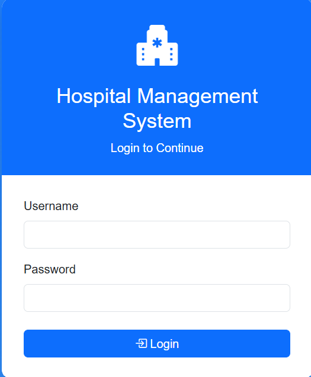
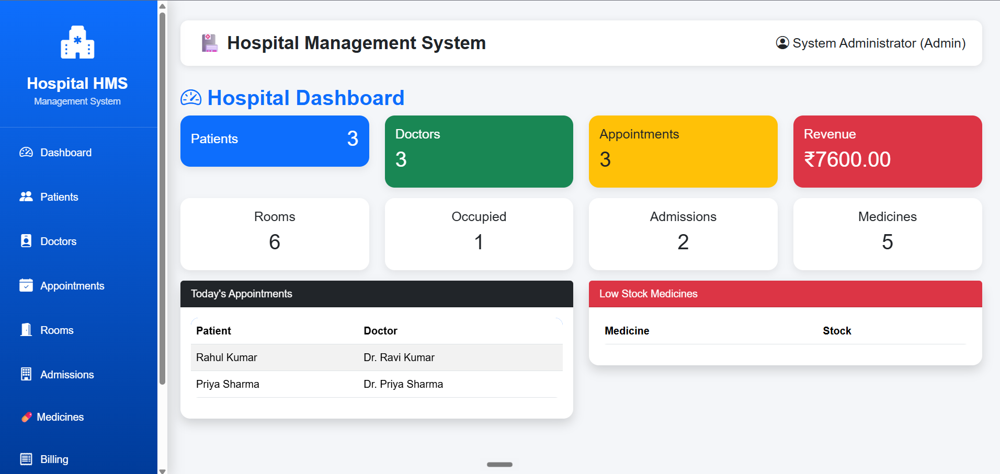
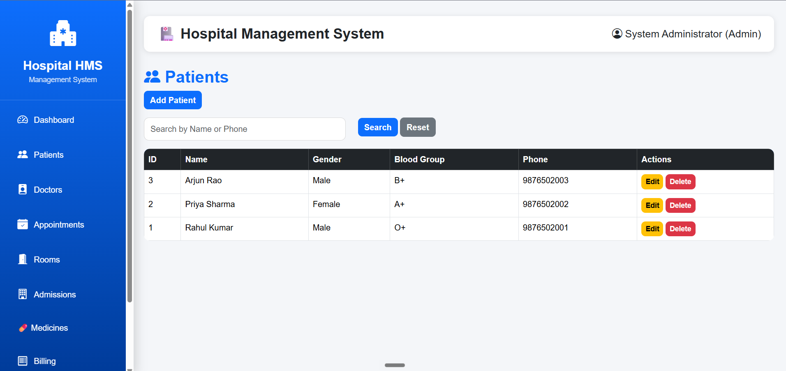
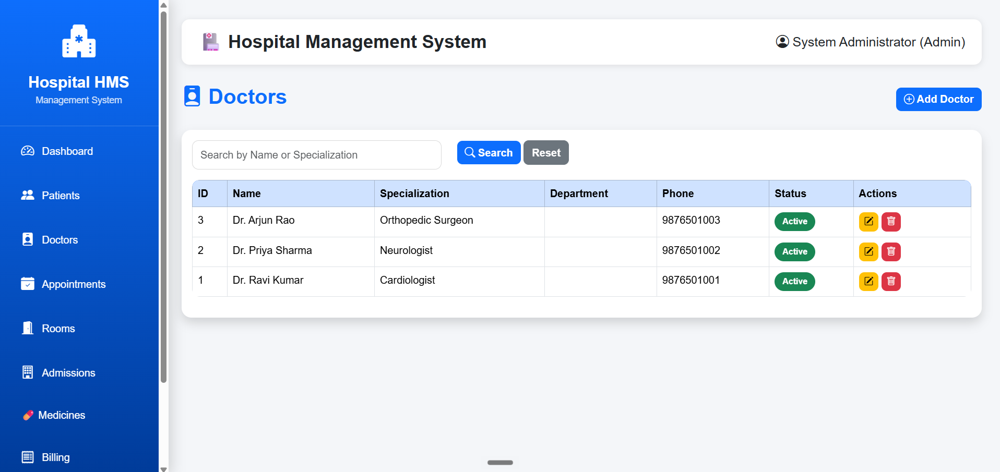
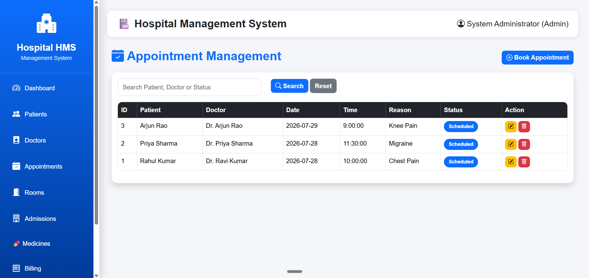
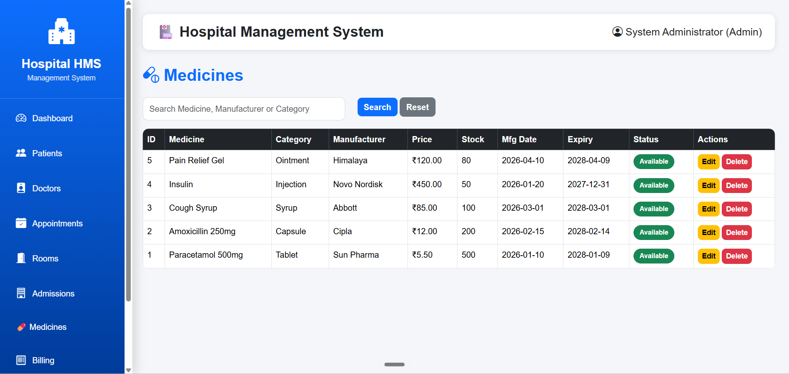
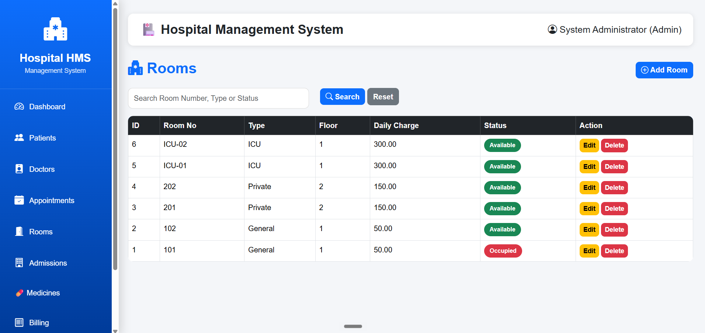
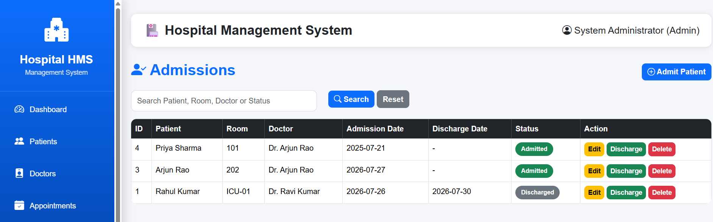
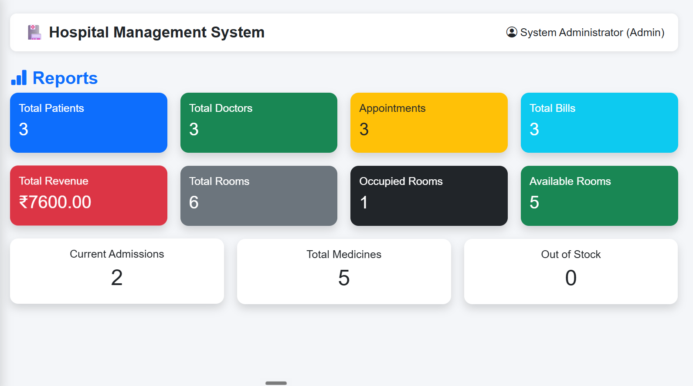

# 🏥 Hospital Management System

A web-based **Hospital Management System (HMS)** developed using **Flask**, **Python**, **MySQL**, and **Bootstrap 5**. The system provides an efficient way to manage hospital operations such as patient records, doctor information, appointments, admissions, billing, medicine inventory, and reports through a secure role-based login system.

---

## 📌 Features

### 🔐 Authentication & Security
- Secure Login System
- Password Hashing
- Session Management
- Role-Based Access Control (RBAC)

### 📊 Dashboard
- Total Patients
- Total Doctors
- Total Appointments
- Total Rooms
- Occupied Rooms
- Total Admissions
- Total Medicines
- Total Revenue
- Today's Appointments
- Low Stock Medicines

### 👨‍⚕️ Patient Management
- Add Patient
- View Patient
- Edit Patient
- Delete Patient
- Search Patient

### 🩺 Doctor Management
- Add Doctor
- View Doctor
- Edit Doctor
- Delete Doctor
- Search Doctor

### 📅 Appointment Management
- Book Appointment
- Update Appointment
- Cancel Appointment
- Search Appointment

### 🛏️ Room Management
- Add Room
- Update Room
- Delete Room
- Search Room
- Room Availability Status

### 🏥 Admission Management
- Admit Patient
- Discharge Patient
- Assign Room
- Assign Doctor
- Search Admission

### 💊 Medicine Management
- Add Medicine
- Update Medicine
- Delete Medicine
- Search Medicine
- Low Stock Monitoring

### 💳 Billing
- Generate Bills
- Update Bills
- Delete Bills
- Revenue Calculation

### 📈 Reports
- Patient Statistics
- Doctor Statistics
- Appointment Statistics
- Room Statistics
- Admission Statistics
- Medicine Statistics
- Revenue Summary

---

# 🛠 Technologies Used

| Technology | Purpose |
|------------|---------|
| Python | Programming Language |
| Flask | Web Framework |
| MySQL | Database |
| Bootstrap 5 | Frontend UI |
| HTML5 | Structure |
| CSS3 | Styling |
| Bootstrap Icons | Icons |
| Jinja2 | Template Engine |
| Werkzeug | Password Hashing & Security |

---

# 📂 Project Structure

```
Hospital_Management_System/
│
├── app.py
├── config.py
├── requirements.txt
├── hospital_management.sql
├── README.md
│
├── routes/
│   ├── auth.py
│   ├── dashboard.py
│   ├── patients.py
│   ├── doctors.py
│   ├── appointments.py
│   ├── rooms.py
│   ├── admissions.py
│   ├── medicines.py
│   ├── bills.py
│   └── reports.py
│
├── static/
│   ├── css/
│   ├── images/
│   └── js/
│
├── templates/
│
└── database/
```

---

# 👥 User Roles

The system supports multiple user roles with different permissions.

| Role | Permissions |
|------|-------------|
| Admin | Full System Access |
| Doctor | View Patients & Appointments |
| Receptionist | Manage Patients & Appointments |
| Accountant | Billing & Reports |

---

# 🗄 Database Modules

- Users
- Patients
- Doctors
- Appointments
- Rooms
- Admissions
- Medicines
- Bills

All modules are connected using MySQL relational tables.

---

# 🚀 Installation

### 1. Clone the Repository

```bash
git clone https://github.com/yourusername/Hospital-Management-System.git
```

### 2. Open the Project

```bash
cd Hospital-Management-System
```

### 3. Create Virtual Environment

```bash
python -m venv venv
```

### 4. Activate Virtual Environment

**Windows**

```bash
venv\Scripts\activate
```

**Linux / macOS**

```bash
source venv/bin/activate
```

### 5. Install Dependencies

```bash
pip install -r requirements.txt
```

### 6. Import Database

Import

```
hospital_management.sql
```

into MySQL.

### 7. Configure Database

Update your MySQL credentials inside the project configuration or database connection file.

### 8. Run the Project

```bash
python app.py
```

Open:

```
http://127.0.0.1:5000
```

---

# 📷 Screenshots


### Login Page



### Dashboard



### Patients



### Doctors



### Appointments



### Medicines



### Rooms



### Admissions




### Reports



# 🔒 Security Features

- Password Hashing using Werkzeug
- Session-Based Authentication
- Role-Based Authorization
- Secure Login Validation

---

# ✨ UI Features

- Responsive Design
- Bootstrap 5
- Bootstrap Icons
- Professional Sidebar
- Dashboard Cards
- Search Functionality
- Hover Effects
- Modern Forms
- Modern Tables

---

# 📌 Future Enhancements

- Email Notifications
- SMS Appointment Alerts
- Online Payment Integration
- Doctor Availability Calendar
- Medical History Upload
- Prescription Management
- PDF Report Generation
- Charts & Analytics
- Backup & Restore Database

---

# 🎯 Learning Outcomes

This project helped in understanding:

- Flask Framework
- Python Backend Development
- MySQL Database Design
- CRUD Operations
- Authentication & Authorization
- Role-Based Access Control
- Bootstrap UI Design
- Database Relationships
- Session Management
- Full-Stack Web Development

---

# 👨‍💻 Author

**Tejas K M**

Bachelor of Engineering (Artificial Intelligence & Machine Learning)

---

# 📄 License

This project is developed for educational purposes and academic learning.

---

## ⭐ If you found this project useful, consider giving it a star on GitHub.

